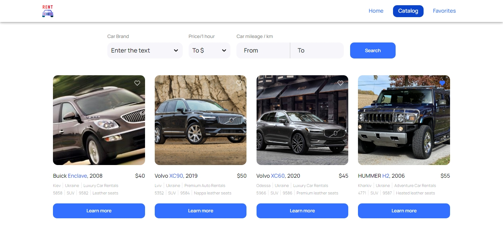
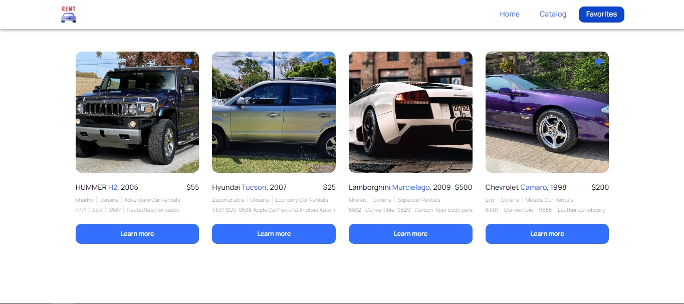

# Rent Car App

Welcome to the Rent Car App GitHub repository! This web application is designed to simplify the car
rental process, offering three main pages: **Home**, **Catalog**, and **Favorites**.

## Home

 The Home page serves as the main entry point, providing
an overview of the application's features and navigation options.

## Catalog

 The Catalog page enables users to explore and select
available cars for rent. Notable features include the ability to filter cars by brand and add
preferred cars to the Favorites list. Users can utilize filters in the Catalog to narrow down car
choices by brand, enhancing the search process. Mark your favorite cars by adding them to the
Favorites list, creating a personalized collection of preferred rental options.

## Favorites

The Favorites page is a repository of selected cars. Easily review and manage added cars to simplify
the decision-making process. Effortlessly access and review added cars on the Favorites page,
streamlining the selection of the desired car for rent.

Feel free to explore the Rent Car App repository and leverage its features for a seamless car rental
experience. Happy coding!
